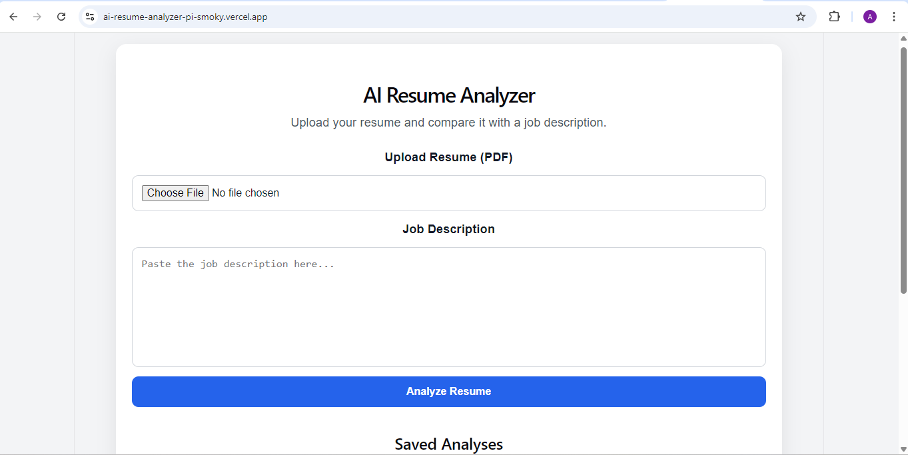
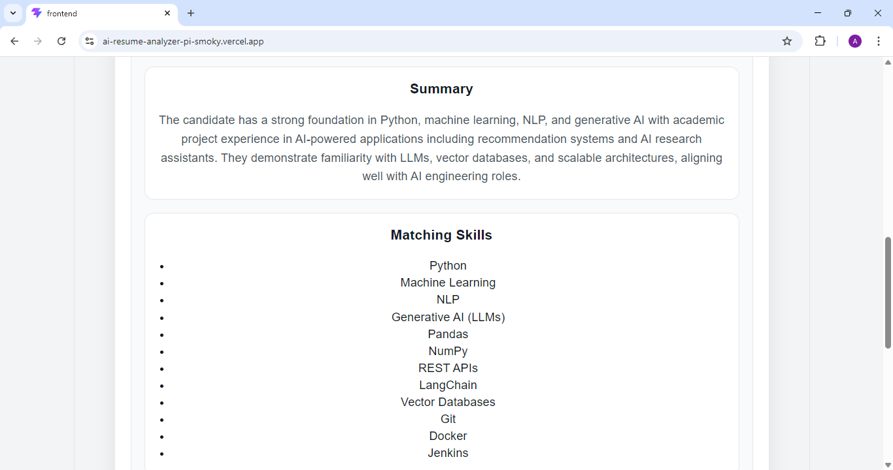
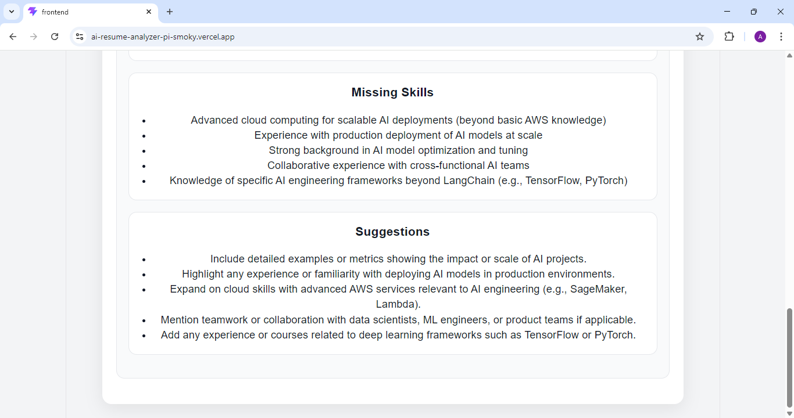
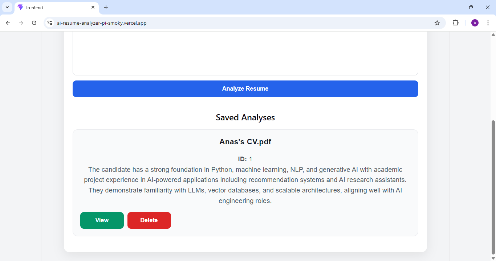
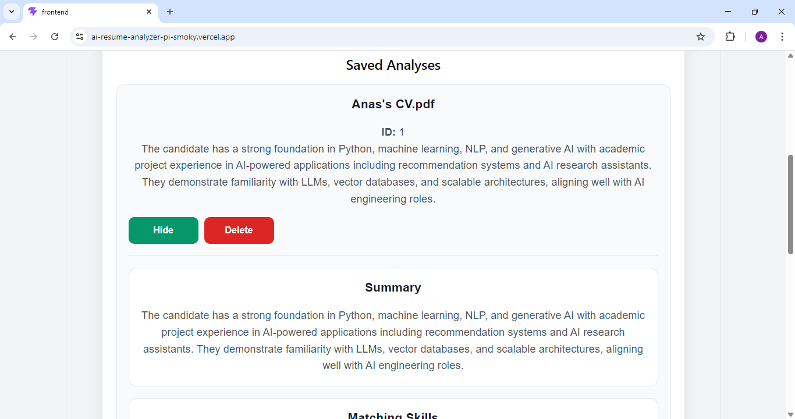

# AI Resume Analyzer

AI Resume Analyzer is a full-stack web application that helps users evaluate their resumes against job descriptions using AI.

Users can upload a resume PDF, paste a job description, and receive structured feedback including:
- summary
- matching skills
- missing skills
- suggestions for improvement

The app also saves analyses in a PostgreSQL database and lets users view and delete previous results.

## Live Demo
Frontend: https://ai-resume-analyzer-pi-smoky.vercel.app  
Backend: https://web-production-0556.up.railway.app

## Features

- Upload resume PDF
- Extract text from PDF
- Compare resume against job description
- Generate AI-powered analysis
- Save analyses to PostgreSQL
- View saved analyses
- View one analysis in detail
- Delete saved analyses
- Guest-based data isolation without login
- Responsive frontend UI

## Tech Stack

### Frontend
- React
- Vite
- CSS

### Backend
- FastAPI
- Python

### Database
- PostgreSQL

### AI
- OpenAI API

### Deployment
- Vercel
- Railway

## Screenshots

### Home


### Analysis Result



### Saved Analyses


### View Saved Analysis


## How It Works

1. User uploads a resume PDF
2. User pastes a job description
3. Backend extracts text from the PDF
4. AI compares the resume with the job description
5. The app returns structured analysis
6. The result is saved in PostgreSQL
7. User can view or delete saved analyses later

## Local Setup

### Backend
```bash
python -m venv venv
venv\Scripts\activate
pip install -r requirements.txt
uvicorn main:app --reload


## Demo Video

Watch the demo here:
https://drive.google.com/file/d/1FQZbedsgCBuBULPqiRJTcQOmxVebAApl/view?usp=drive_link